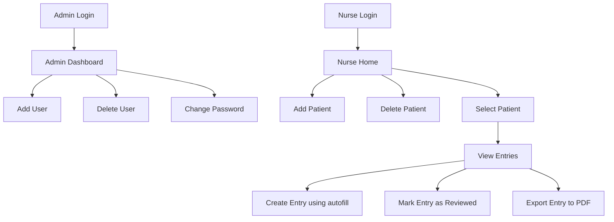

## VChart Demo – Walkthrough & Feature Highlights

### What's VChart?

VChart is an AI-powered charting tool designed for nurses. It simplifies patient documentation, offering an intuitive workflow to log, review, and export patient data. Admins can manage users securely, and nurses can focus on care, not paperwork.

This demo covers two main user flows: **Admin** and **Nurse**.

LInk to demo: https://drive.google.com/file/d/1UMx4YuTAQ3G0JyqtRwisu2ecpwjH55-r/view
---

## Admin Flow

Admins (especially the first admin) are created manually in the database and have secure access to a user management panel.

### Features:
- **Login as Admin**
  - username: admin  
  - password: password
    
  ➤ Redirects to `/admin/users/`

  

- **User Management**  
  ➤ Add new users (nurses or admins)  
  ➤ Delete users  
  ➤ Change passwords for users

> All routes are protected and role-restricted.

---

## Nurse Flow

Nurses can log in and seamlessly manage patients and their charts.

### Features:
- **Login as Nurse**
  - username: test
  - password: password
    
  ➤ Redirects to `/` – patient list view

- **Patient Management**  
  ➤ Add new patients  
  ➤ Delete patients  

- **Charting Entries**  
  ➤ Select a patient → view all chart entries  
  ➤ Create new entry with **autofill feature** (AI-assisted)  
  ➤ Save entries  
  ➤ View entries individually  
  ➤ Mark entries as **reviewed**  
  ➤ Export entries to **PDF**

---

### User Flow Summary

---

## HIPAA Considerations

While a full HIPAA-compliant deployment includes many **administrative and physical safeguards** outside the scope of an MVP, we’ve implemented key **technical safeguards** to support future compliance:

### Current Implementations
- **Data Encryption**
  - MongoDB Atlas encrypts data **at rest** and **in transit** by default.
- **Access Controls (RBAC)**
  - Role-based access controls are enforced across the system to separate privileges between admins and nurses.
- **Logging**
  - Actions like user creation, login attempts, and chart exports are tracked for auditability.

> ⚠ Administrative safeguards (e.g., BAA agreements, physical security, and ongoing HIPAA training) are not covered in this MVP stage but are part of our future compliance roadmap.

---

##  Code Quality

As part of our CI pipeline, we’ve integrated tools to **enforce and measure code quality**, helping us maintain a clean, maintainable, and reliable codebase.

> **CI Run Example**: [GitHub Actions](https://github.com/dcsil/vchart-app/actions/runs/14370116124/job/40291479501)  

### Linting – ESLint

We use **[ESLint](https://eslint.org/)** to catch bugs, enforce consistent coding style, and ensure best practices. It is configured with a strict ruleset (based on `eslint:recommended` + React/Next.js plugins) and runs automatically in CI.

- Detects unused variables and unreachable code
- Enforces consistent patterns and syntax
- Catches potential bugs early in development

**Status**: Fully integrated in CI  
**Satisfaction**: Satisfactory — ensures team-wide consistency and high-quality code before merge.

---

### Test Coverage – Jest + React Testing Library

We use **Jest** and **React Testing Library** to test both frontend components and backend logic. 

**Statement Coverage**: **84.84%**    
> 📊 [View Full HTML Report](https://htmlpreview.github.io/?https://raw.githubusercontent.com/dcsil/vchart-app/main/coverage/lcov-report/index.html)

- We aim to improve **branch and function coverage** in upcoming iterations

**Satisfaction**: Good for an MVP — further improvements in conditional paths and edge cases are planned.

